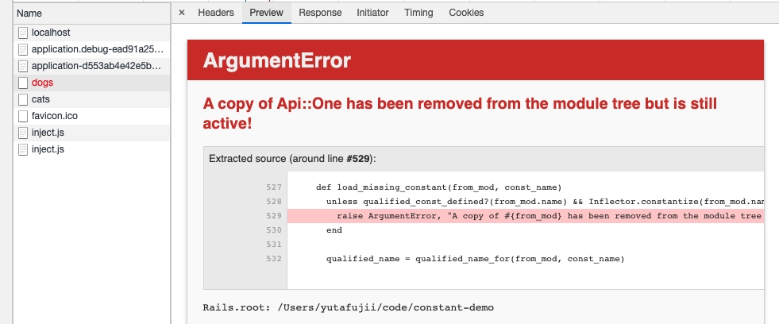
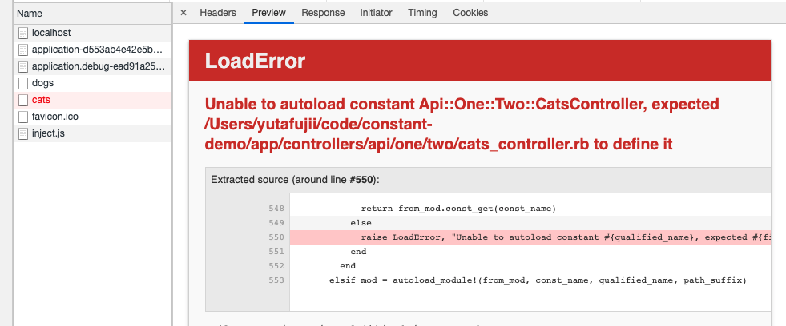

# Reproduce Procedure

1. run `rails s` command and start server
2. In your browser, request http://localhost:3000/  You'll probably see dogs and cats list.
3. In DogsController, comment this out and save

```
'Do some work and change files'
```

4. In CatsController, comment this out and save

```
'Do some work and change files'
```

5. Reload the page, and you will **sometimes** see either dogs/cats is not listed, when the error is occurred.
6. If you don't see the bug, comment those lines in and reload. And retry these process.

## Bugs

Below two bugs occur.

### A copy of Api::One has been removed from the module tree but is still active!


### Unable to autoload constant Api::One::Two::CatsController, expected /constant-demo/app/controllers/api/one/two/cats_controller.rb to define it


